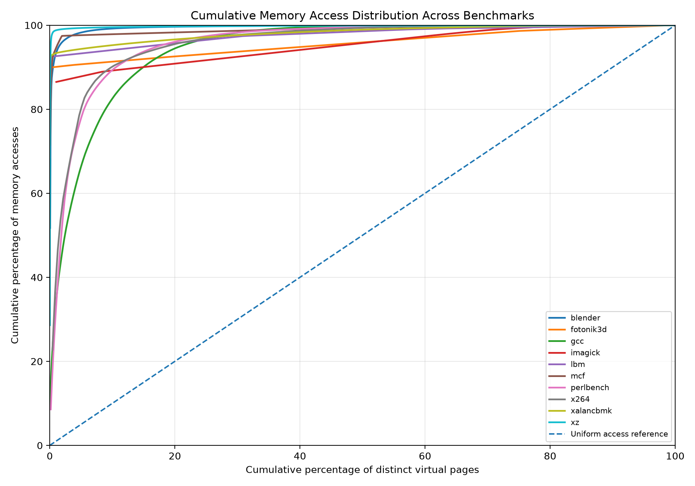

# Memory Management Simulator — Laboratory 4

## 1. Introduction

This project implements a C++ simulator for studying virtual-memory management using memory-access traces. It evaluates single-level and two-level page tables, a translation lookaside buffer (TLB), limited physical memory with LRU page replacement, and simulator runtime.

The experiments use ten benchmark traces: GCC, Blender, Fotonik3d, Imagick, LBM, MCF, Perlbench, x264, xalancbmk, and xz.

## 2. Experimental setup and assumptions

- Virtual addresses are treated as 32-bit values; the lower 32 bits are used.
- Page size: 4,096 bytes (4 KiB).
- Virtual page count: 2^20 = 1,048,576.
- Main-memory access cost: 200 cycles.
- TLB lookup cost: 1 cycle.
- TLB capacity: 128 entries, fully associative, using LRU replacement.
- Disk access cost for a page replacement: 20,000,000 cycles.
- Initial page loads into free frames do not incur the disk replacement penalty.
- Physical-memory experiments use LRU page replacement.

The reported values are simulator-model results, not measurements of physical hardware.

## 3. Part I — Single-level page table

The single-level page table contains 2^20 entries. For each memory access, the simulator derives the virtual page number (VPN) from the lower 32 address bits and maps the page to a physical frame. The reported frame count is the number of distinct pages loaded during the trace.

Page-table utilization is calculated as the fraction of all virtual page-table entries accessed, expressed as a percentage. The modeled cost is 400 cycles per access: one page-table memory access and one data memory access, each costing 200 cycles.

| Benchmark | Accesses | Frames used | PT utilization | Cycles | Final hash |
| --- | --- | --- | --- | --- | --- |
| Blender | 12,369,560 | 1,551 | 0.147915% | 4,947,824,000 | 6301118069575916148 |
| Fotonik3d | 12,890,021 | 1,602 | 0.152779% | 5,156,008,400 | 10137137509941736082 |
| GCC | 12,473,306 | 990 | 0.0944138% | 4,989,322,400 | 14777851298613679523 |
| Imagick | 11,548,820 | 96 | 0.00915527% | 4,619,528,000 | 8398918936944434197 |
| LBM | 12,843,431 | 2,131 | 0.203228% | 5,137,372,400 | 15766630910185595687 |
| MCF | 12,474,523 | 1,597 | 0.152302% | 4,989,809,200 | 8560889819576637280 |
| Perlbench | 12,568,037 | 630 | 0.0600815% | 5,027,214,800 | 811776898941333851 |
| x264 | 11,721,344 | 234 | 0.022316% | 4,688,537,600 | 1761089164923836391 |
| xalancbmk | 11,972,261 | 14,325 | 1.36614% | 4,788,904,400 | 9990451796837608704 |
| xz | 11,852,222 | 8,037 | 0.766468% | 4,740,888,800 | 7533494436177899456 |

The frame counts range from 96 pages for Imagick to 14,325 pages for xalancbmk. Page-table utilization is low because each trace touches only a small subset of the 1,048,576 possible virtual pages.

### Page-access distribution

The following graph plots the cumulative percentage of memory accesses against the cumulative percentage of distinct virtual pages, with pages ordered from most frequently accessed to least frequently accessed.

| Benchmark | Total accesses | Distinct pages | Accesses from hottest 10% of pages |
| --- | --- | --- | --- |
| BLENDER | 12,369,560 | 1,551 | 99.21% |
| FOTONIK3D | 12,890,021 | 1,602 | 91.34% |
| GCC | 12,473,306 | 990 | 82.53% |
| IMAGICK | 11,548,820 | 96 | 89.29% |
| LBM | 12,843,431 | 2,131 | 94.11% |
| MCF | 12,474,523 | 1,597 | 97.86% |
| PERLBENCH | 12,568,037 | 630 | 89.34% |
| x264 | 11,721,344 | 234 | 90.37% |
| xalancbmk | 11,972,261 | 14,325 | 95.25% |
| XZ | 11,852,222 | 8,037 | 99.54% |

Across these traces, the hottest 10% of distinct pages account for 82.53%–99.54% of accesses. This indicates highly concentrated page-access patterns in the supplied traces. It also helps explain why a small TLB can achieve a high hit rate.

## 4. Part II — Two-level page table

The two-level design divides the 20-bit VPN into two 10-bit indices. A level-1 table points to lazily allocated level-2 tables. This avoids allocating every possible second-level table when only a subset of the address space is used.

| Benchmark | L1 tables/entries | L2 tables/entries | Total modeled cycles | Hash comparison |
| --- | --- | --- | --- | --- |
| Blender | 47 | 1,551 | 7,421,736,000 | Matches Part I |
| Fotonik3d | 14 | 1,602 | 7,734,012,600 | Matches Part I |
| GCC | 70 | 990 | 7,483,983,600 | Matches Part I |
| Imagick | 5 | 96 | 6,929,292,000 | Matches Part I |
| LBM | 6 | 2,131 | 7,706,058,600 | Matches Part I |
| MCF | 13 | 1,597 | 7,484,713,800 | Matches Part I |
| Perlbench | 48 | 630 | 7,540,822,200 | Matches Part I |
| x264 | 11 | 234 | 7,032,806,400 | Matches Part I |
| xalancbmk | 54 | 14,325 | 7,183,356,600 | Matches Part I |
| xz | 43 | 8,037 | 7,111,333,200 | Matches Part I |

The final hash matches Part I for every benchmark, providing a consistency check that both page-table organizations map the same trace accesses to the same frame sequence. The two-level design incurs an additional page-table access in the modeled cost, so its total cycle count is higher than the single-level design in this experiment. Its potential benefit is reduced page-table allocation for sparse address spaces.

## 5. Part III — Translation lookaside buffer

The simulator adds a 128-entry fully associative LRU TLB. Each lookup costs 1 cycle. A TLB hit requires the TLB lookup and data access; a miss also incurs page-table access cost. The table below reports the measured hit/miss counts and modeled cycles for both page-table designs.

| Benchmark | TLB hits | TLB misses | Hit rate | Single-level cycles | Two-level cycles |
| --- | --- | --- | --- | --- | --- |
| Blender | 12,362,108 | 7,452 | 99.9398% | 2,487,771,960 | 2,489,262,360 |
| Fotonik3d | 12,888,304 | 1,717 | 99.9867% | 2,591,237,621 | 2,591,581,021 |
| GCC | 12,459,259 | 14,047 | 99.8874% | 2,509,943,906 | 2,512,753,306 |
| Imagick | 11,548,724 | 96 | 99.9992% | 2,321,332,020 | 2,321,351,220 |
| LBM | 12,840,727 | 2,704 | 99.9789% | 2,582,070,431 | 2,582,611,231 |
| MCF | 12,404,926 | 69,597 | 99.4421% | 2,521,298,523 | 2,535,217,923 |
| Perlbench | 12,511,278 | 56,759 | 99.5484% | 2,537,527,237 | 2,548,879,037 |
| x264 | 11,717,345 | 3,999 | 99.9659% | 2,356,789,944 | 2,357,589,744 |
| xalancbmk | 11,956,370 | 15,891 | 99.8673% | 2,409,602,661 | 2,412,780,861 |
| xz | 11,824,591 | 27,631 | 99.7669% | 2,387,822,822 | 2,393,349,022 |

TLB hit rates range from 99.4421% (MCF) to 99.9992% (Imagick). Because the TLB services nearly all accesses, modeled cycles are substantially lower than in the no-TLB page-table models. The two-level configuration has slightly higher cycle counts because TLB misses require an extra page-table lookup.

## 6. Part IV — Limited physical memory and LRU replacement

The simulator was evaluated with capacities of 256 frames, 512 frames, and 262,144 frames. The first two are small-capacity stress tests that expose replacement behavior. The 262,144-frame capacity corresponds to 25% of the 1,048,576-page virtual address space. At this capacity, none of these traces requires replacement because each trace's working set is smaller than the available frame count.

A page fault occurs whenever a referenced page is not resident. A replacement occurs only when a page fault happens and all frames are occupied. Initial page loads into free frames incur no disk penalty. The cycle model is:

**Total cycles = 200 × memory accesses + 20,000,000 × replacements**

The fault rate is page faults divided by total memory accesses, expressed as a percentage.

| Benchmark | Capacity | Frames used | Faults | Replacements | Fault rate | Total cycles |
| --- | --- | --- | --- | --- | --- | --- |
| Blender | 256 | 256 | 4,710 | 4,454 | 0.0380773% | 91,553,912,000 |
| Blender | 512 | 512 | 3,873 | 3,361 | 0.0313107% | 69,693,912,000 |
| Blender | 262,144 | 1,551 | 1,551 | 0 | 0.0125388% | 2,473,912,000 |
| Fotonik3d | 256 | 256 | 1,717 | 1,461 | 0.0133204% | 31,798,004,200 |
| Fotonik3d | 512 | 512 | 1,717 | 1,205 | 0.0133204% | 26,678,004,200 |
| Fotonik3d | 262,144 | 1,602 | 1,602 | 0 | 0.0124282% | 2,578,004,200 |
| GCC | 256 | 256 | 4,994 | 4,738 | 0.0400375% | 97,254,661,200 |
| GCC | 512 | 512 | 2,216 | 1,704 | 0.0177659% | 36,574,661,200 |
| GCC | 262,144 | 990 | 990 | 0 | 0.00793695% | 2,494,661,200 |
| Imagick | 256 | 96 | 96 | 0 | 0.000831254% | 2,309,764,000 |
| Imagick | 512 | 96 | 96 | 0 | 0.000831254% | 2,309,764,000 |
| Imagick | 262,144 | 96 | 96 | 0 | 0.000831254% | 2,309,764,000 |
| LBM | 256 | 256 | 2,704 | 2,448 | 0.0210536% | 51,528,686,200 |
| LBM | 512 | 512 | 2,704 | 2,192 | 0.0210536% | 46,408,686,200 |
| LBM | 262,144 | 2,131 | 2,131 | 0 | 0.0165921% | 2,568,686,200 |
| MCF | 256 | 256 | 40,583 | 40,327 | 0.325327% | 809,034,904,600 |
| MCF | 512 | 512 | 9,119 | 8,607 | 0.073101% | 174,634,904,600 |
| MCF | 262,144 | 1,597 | 1,597 | 0 | 0.0128021% | 2,494,904,600 |
| Perlbench | 256 | 256 | 20,365 | 20,109 | 0.162038% | 404,693,607,400 |
| Perlbench | 512 | 512 | 898 | 386 | 0.00714511% | 10,233,607,400 |
| Perlbench | 262,144 | 630 | 630 | 0 | 0.00501272% | 2,513,607,400 |
| x264 | 256 | 234 | 234 | 0 | 0.00199636% | 2,344,268,800 |
| x264 | 512 | 234 | 234 | 0 | 0.00199636% | 2,344,268,800 |
| x264 | 262,144 | 234 | 234 | 0 | 0.00199636% | 2,344,268,800 |
| xalancbmk | 256 | 256 | 14,992 | 14,736 | 0.125223% | 297,114,452,200 |
| xalancbmk | 512 | 512 | 14,977 | 14,465 | 0.125098% | 291,694,452,200 |
| xalancbmk | 262,144 | 14,325 | 14,325 | 0 | 0.119652% | 2,394,452,200 |
| xz | 256 | 256 | 24,048 | 23,792 | 0.202899% | 478,210,444,400 |
| xz | 512 | 512 | 19,976 | 19,464 | 0.168542% | 391,650,444,400 |
| xz | 262,144 | 8,037 | 8,037 | 0 | 0.0678101% | 2,370,444,400 |

### Interpretation

- At 262,144 frames, all page faults are first-time loads; replacements are zero for all ten traces.
- With 512 frames, Imagick and x264 fit their observed working sets and need no replacement. Other traces incur replacement costs to varying degrees.
- Reducing capacity from 512 to 256 frames increases replacements for several benchmarks, particularly MCF and Perlbench, which sharply increases their modeled total cycles.
- Capacity sensitivity depends on each trace's working set and access pattern; fault rate alone does not show the full cycle impact because each replacement incurs a large disk penalty.

The assignment's 50% capacity example is 524,288 frames. The full 524,288-frame experiment was checked on GCC and produced no replacements; the 262,144-frame configuration was run across all ten benchmarks.

## 7. Part V — Simulator runtime

The following wall-clock times were recorded for the optimized trace parser in earlier runs. They are environment-dependent observations, not guaranteed runtimes.

| Benchmark | Accesses | Frames used | Modeled cycles | Observed runtime (s) |
| --- | --- | --- | --- | --- |
| GCC | 12,473,306 | 990 | 4,989,322,400 | 0.456 |
| Blender | 12,369,560 | 1,551 | 4,947,824,000 | 0.904 |
| Fotonik3d | 12,890,021 | 1,602 | 5,156,008,400 | 0.932 |
| Imagick | 11,548,820 | 96 | 4,619,528,000 | 0.733 |
| LBM | 12,843,431 | 2,131 | 5,137,372,400 | 0.898 |
| MCF | 12,474,523 | 1,597 | 4,989,809,200 | 0.868 |
| Perlbench | 12,568,037 | 630 | 5,027,214,800 | 0.883 |
| x264 | 11,721,344 | 234 | 4,688,537,600 | 0.854 |
| xalancbmk | 11,972,261 | 14,325 | 4,788,904,400 | 0.834 |
| xz | 11,852,222 | 8,037 | 4,740,888,800 | 0.877 |

The recorded runtimes range from 0.456 s for GCC to 0.932 s for Fotonik3d. Actual runtime depends on the machine, operating-system load, compiler, and build configuration.

## 8. Overall conclusions

1. The traces touch only a small fraction of the possible virtual-page space, so single-level page-table utilization remains low.
2. The page-distribution graph shows strong access concentration: the hottest 10% of pages account for a large majority of accesses in every benchmark.
3. The two-level page-table implementation reproduces the Part I hash for all benchmarks, while its modeled miss cost is higher because it requires an additional lookup.
4. The 128-entry LRU TLB achieves hit rates above 99.4% on all supplied traces, substantially reducing modeled access cycles.
5. LRU replacement costs become significant when frame capacity is smaller than a trace's working set. The large modeled disk penalty makes replacement count a major contributor to total cycles.
6. Runtime measurements show that the optimized simulator processes each trace in under one second in the recorded environment, though results may vary across systems.

## 9. Reproducibility and limitations

- The benchmark traces are local experimental inputs and are not included in this report.
- The CSV files in this directory preserve the benchmark results used to construct the tables.
- The page-access distribution graph is generated by `analyze_page_distribution.py`; use `MPLBACKEND=Agg python report/analyze_page_distribution.py` on headless or graphics-sensitive environments.
- Part V wall-clock times are historical measurements and may vary when rerun.
- The cycle counts are based on the assignment's abstract cost model and should not be interpreted as real CPU cycle measurements.

## Appendix — Result files

- `parts1_3_results.csv` — Parts I–III benchmark results.
- `part4_results.csv` — Part IV capacity experiments.
- `part5_runtime.csv` — Part V runtime measurements.
- `page_distribution_summary.csv` — distinct-page and locality summary.
- `figures/page_access_distribution.png` — cumulative page-access distribution graph.
- `analyze_page_distribution.py` — script used to generate the graph and summary.
